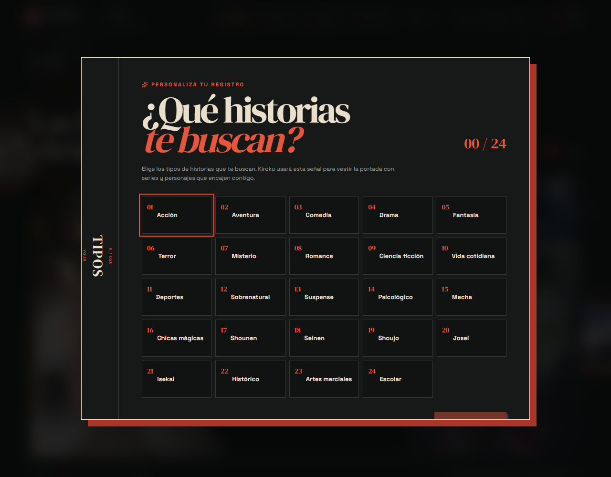
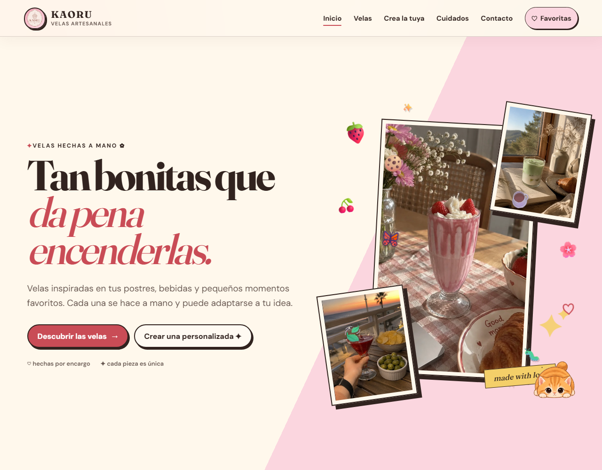
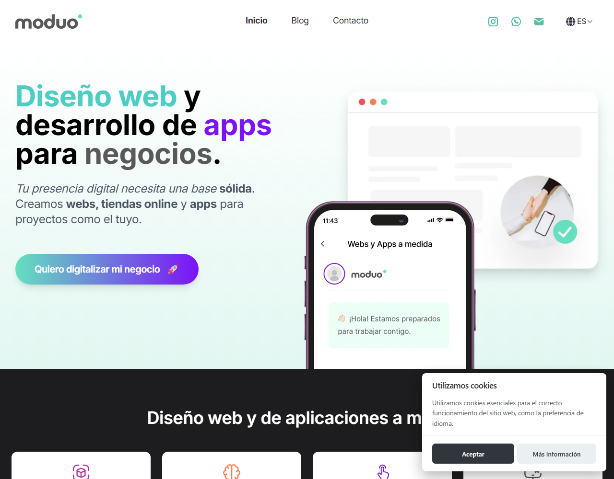

# Hey, I'm Pere 👋

**Frontend Developer** specialized in **Angular** and **Ionic**, based in Valencia, Spain 🇪🇸

I've delivered **15+ projects** across industries like real-time crypto trading and e-commerce. I take ownership of full-cycle development, mentor teammates, and care deeply about clean, maintainable, high-performance code.

## What I work with

## 🚀 Featured projects

<table>
  <tr>
    <td align="center" width="50%">
      
       
      <strong>Kiroku</strong> · Your anime log
       
      Sole developer & designer
    </td>
    <td align="center" width="50%">
      
       
      <strong>Kaoru</strong> · Handmade candles
       
      Sole developer & designer
    </td>
  </tr>
  <tr>
    <td align="center" width="50%" colspan="2">
      
       
      <strong>moduo</strong> · Web design & development studio
       
      Co-founder · developer & seller
    </td>
  </tr>
</table>

## Experience

- **DEXTOOLS** (Remote) — Frontend Developer · 2024 – Present
  Real-time crypto trading platform: high-performance data flows, clean trading UI, blockchain data.
- **Alten** (Valencia) — Frontend Developer · 2023
- **Rudo Apps** (Valencia) — Ionic Developer · 2021 – 2023
  Internship supervisor and client liaison across multiple projects.

## Languages

- 🇪🇸 Spanish — Native
- 🇬🇧 English — Advanced